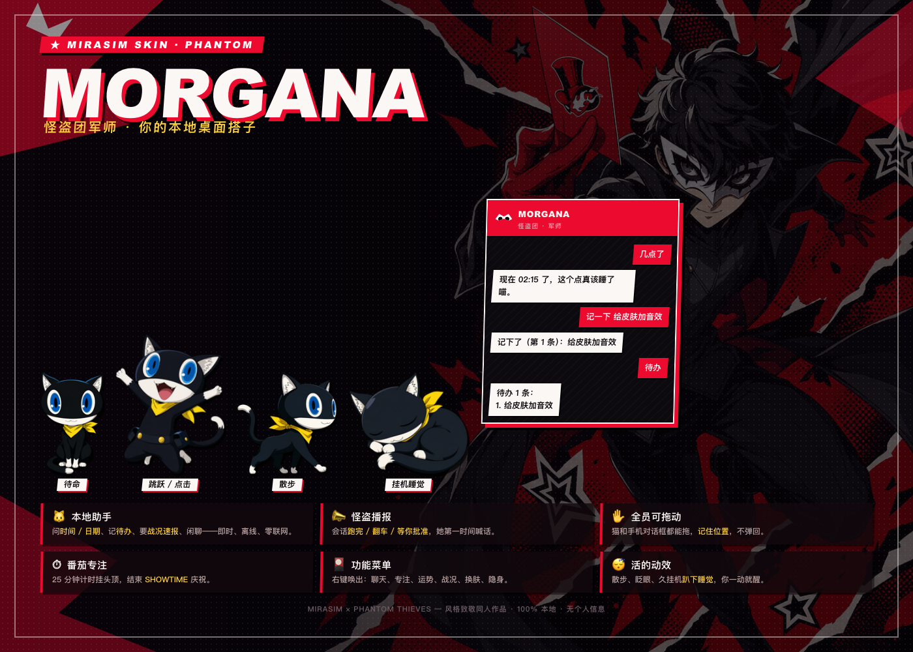
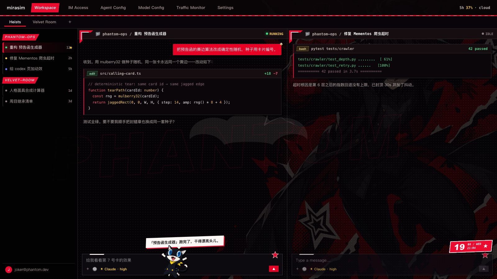
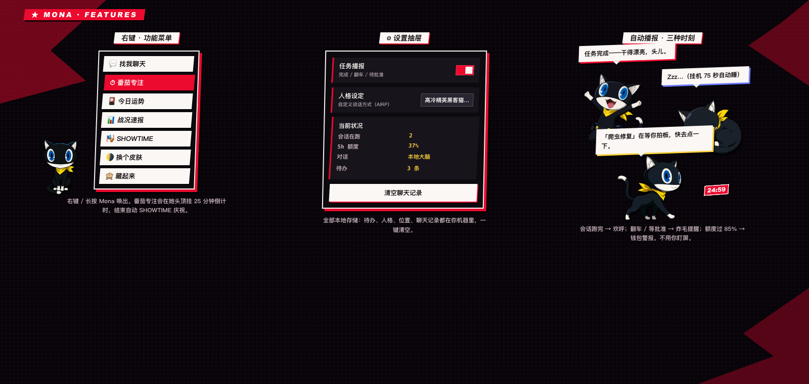

# mirasim-skin-persona5

[English](README.md) · **简体中文**

给 Mirasim 桌面客户端的**怪盗 / Phantom-thief** 皮肤 —— 取材自《女神异闻录 5 皇家版》
的墨黑 / 预告函红 / 面具白配色，外加一只活的 **摩尔加纳桌宠**（Mona）：能聊天、
播报你的会话战况、还能给你开番茄钟。

> 风格致敬 / 同人作品。所有图形、台词、技能图鉴均为原创；角色立绘为 P5R 视觉语汇下的
> AI 生成图。不含官方 logo、不含游戏素材、不含任何受版权保护的文本。



**模拟工作区**（画面内容全部为虚构）：



**Mona 的功能：**



## 安装

```bash
./install.sh          # 注入 Mirasim 的本地前端，无需管理员权限
```

然后 **⌘R 刷新 Mirasim 窗口**（或重启客户端）。

- 皮肤改的是 Mirasim 那份用户可写的自更新副本
  （`~/.mirasim/app/<版本号>/{web,renderer}/index.html`），**不是**已签名的
  app bundle —— 可逆，不影响代码签名。
- 客户端升级会生成新的版本目录，皮肤随之失效，重跑一遍 `./install.sh` 即可。

```bash
./uninstall.sh        # 还原原版界面
```

## 你会得到什么

**皮肤本体** —— 一整套高对比度 P5 设计令牌覆盖：墨黑底色、锋利（去圆角）转角、
硬投影、红色主操作 / 白色强调、撕裂碎片转角、面具水印、空面板里铺满的巨大
`PHANTOM` 字标、斜切标签页，以及皮肤启用时的预告函入场动画。

**摩尔加纳（Mona）** —— 一只精灵图桌宠，她可以：

以下功能**默认全本地 —— 不联网、不需要密钥、不额外起进程。**

| 功能 | 玩法 |
|---|---|
| **本地助手对话** | 点 Mona → 手机聊天框。问时间 / 日期、记待办（`记一下 …` / `待办` / `删 2`）、要战况速报（`战况`），或者纯闲聊。即时响应、离线可用，并会读取你当前的额度与在跑会话作为上下文。 |
| **自定义人格** | 聊天框里的 ⚙ → 人格设定。可调教她的说话方式（AIRP 友好）。 |
| **怪盗播报** | 会话**跑完 / 报错 / 等你批准**时开口，额度冲过 85% 也会喊你。 |
| **番茄专注** | 右键 → 番茄专注：25 分钟专注结界，头顶挂倒计时，结束接 SHOWTIME。 |
| **功能菜单** | 右键 / 长按：聊天、专注、运势、战况速报、SHOWTIME、换皮肤、隐身。 |
| **可拖拽** | 猫和她的手机都能拖到任意位置，位置会记住。 |
| **活的动效** | 散步、眨眼、久挂机趴下睡觉、被点击会跳起来。 |

> **可选的大模型自由问答**（默认关闭）：设置里那个开关只会请求
> `http://127.0.0.1:51789` —— 一个**你自己启动**的本地桥。本仓库不包含、也不会启动
> 任何这样的进程，开关不打开就完全不会发出这个请求。之所以只能走 127.0.0.1：Mirasim
> 桌面窗口的 CSP 只允许页面访问本机回环地址，而 Mirasim 自己的模型代理是按会话动态
> 端口的，没法稳定连上。为了保持零依赖、纯离线，这个桥本身刻意没有打包进来。

### 快捷键

- `Alt+Shift+K` —— 开关皮肤
- `Alt+Shift+S` —— SHOWTIME
- `Alt+Shift+U` —— 显示 / 隐藏日期挂件
- `Alt+Shift+M` —— 显示 / 隐藏 Mona

## 技能图鉴

`codex.html` 是一张独立的竖屏**怪盗团技能表**，主角是摩尔加纳 —— 4 个技能
（各自标注 SP 消耗 / 属性 / 战斗定位）外加一记 SHOWTIME 终结技，按 P5R 的舞台感排版。
用任意浏览器打开即可。她的 SP 会跟着你的剩余额度走，很有代入感。

## 隐私

Mona **默认 100% 本地**：聊天记录、待办、人格设定、位置全部存在浏览器的
`localStorage` 里，不会写进本仓库的任何文件。默认状态下她**不发起任何网络请求**，
不连外部 API、不需要密钥、不跑后台进程。唯一的例外是上面那个默认关闭的大模型开关，
且它只会访问 `127.0.0.1` 回环地址，数据不出本机。仓库内不含任何密钥、令牌、账号或
本机路径。

## 目录结构

```
skin/persona5.css     设计令牌 + 组件 + Mona 样式
skin/persona5.js      单主题开关 + 特效 / Mona 引擎
skin/assets/          摩尔加纳精灵图 + Joker 主视觉壁纸
codex.html            怪盗团技能表
install.sh / uninstall.sh
```
